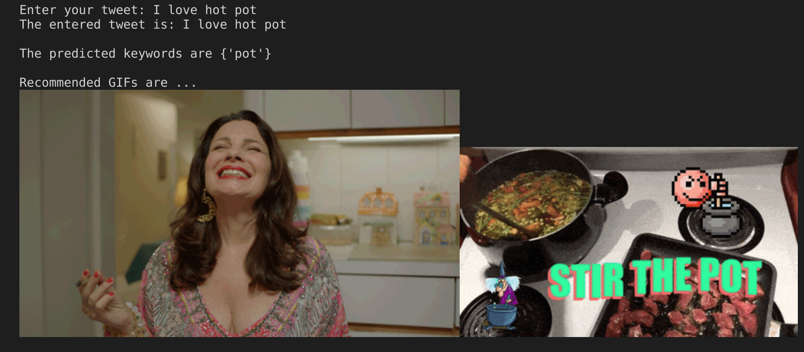

# Twitter Keyword Extraction

## Introduction

The objective of this project is to compare, discuss, and develop a text-based animated GIFs Recommender that can be incorporated into many social media platforms such as Twitter, Messenger, WeChat, WhatsApp, etc. Using Natural Language Processing, we can extract keywords from text messages, then generate a list of recommended GIFs that are suitable for the context.
We use a Bidirectional-Long-Short-Term-Memory (BLSTM) model with semi-supervised learning to extract keywords from tweets, and use a statistical approach named Term Frequency-Inverse Document Frequency (TF-IDF) as a baseline method to be compared with our method.

## Features

The keyword extraction problem is tackled using a Bidirectional-Long-Short-Term-Memory (BLSTM) model with semi-supervised learning, and we compare the model performance of TF-IDF, supervised learning, semi-supervised learning. Our research shows that the semi-supervised learning gives the best performance.

The final project is an application that can take user's twitter message, and automatically generate a list of GIFs based on the model-extracted keyword. (To be implemented...)

## Required Library

`tweet-preprocessor`, `spacy` for data preprocessing

`numpy`, `tensorflow`, `matplotlib` for model building

## Commands to Run Code

### Data Preprocessing

`python3 preprocessing-labeled.py starting_index ending_index`
`python3 preprocessing-unlabeled.py starting_index ending_index`

Example:
`python3 preprocessing-unlabeled.py 1 100`
It will preprocess the first 100 twitter messages in file `saved_tweets.csv` which contains all the downloaded twitter messages.

The script `data_preprocessing/data_preprocessing.sh` can generate all the processed data we need for TF-IDF and RNN.

### Running TF-IDF

`python3 tfidf.py`
It will compute the TF-IDF score of preprocessed tweets, and produce the precision, recall, and F1-score for evaluating the performance of TF-IDF keyword extraction method.

### Running RNN

The Jupyter Notebook can be run on Goggle Colab or with Jupyter. The global variables control the hyperparameters of the model, which are displayed below:

| variable              | meaning                                                            | default value |
| --------------------- | ------------------------------------------------------------------ | ------------- |
| threshold             | The confidence threshold for unlabeled data to be used for traning | 0.01          |
| hidden_size           | Number of nodes in the hidden layer                                | 100           |
| word_embedding_dim    | Dimension of word embedding                                        | 300           |
| epochs                | Training epochs                                                    | 10            |
| use_unlabeled_dataset | Whether to utilize unlabeled dataset                               | True          |

## Demo

The final project is an application that can take user's twitter message, and automatically generate a list of GIFs based on the model-extracted keyword. 

To run the demo, use the command `jupyter notebook demo.ipynb`. The users would see an input box at the end of the notebook. The users may input a tweet there, and then the program would output a list of GIFs suitable for the tweet. 

## Contributors

This project is developed by [Yiran Cao](https://github.com/yiran0427), [Guanzhao Wang](https://github.com/g95wang), and [Haochen Wu](https://github.com/JasonWu1103).

## License

This project is licensed under the MIT License - see the [LICENSE](LICENSE) file for details.
